<div align="center">

# Senku

**A science-based training and nutrition companion for iPhone and Apple Watch —
one that shows its work.**

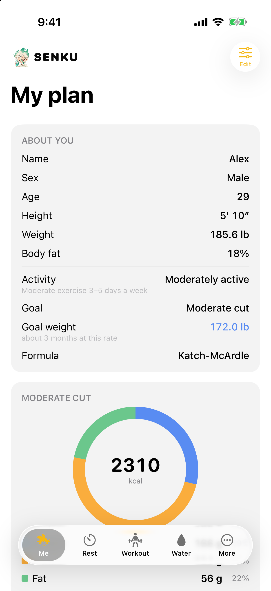 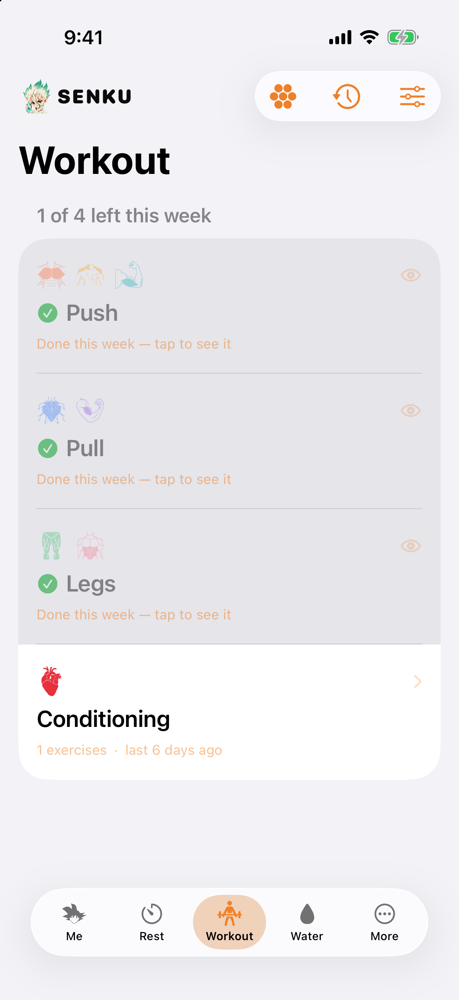 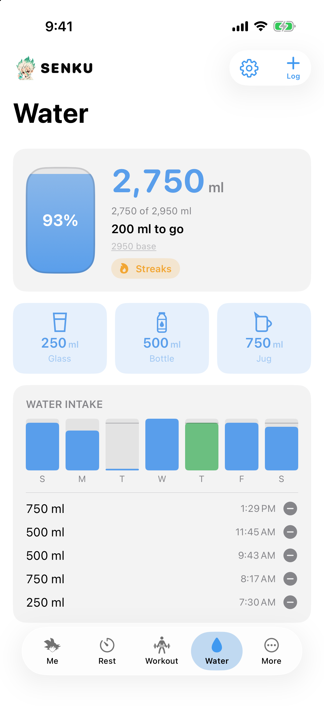 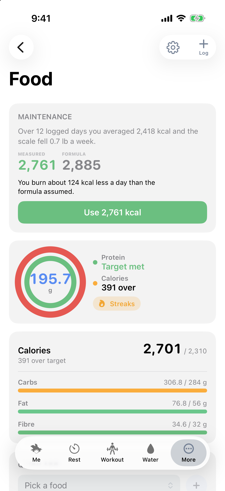

</div>

---

Most macro calculators hand you a number with no explanation — no indication of
which formula produced it, and no warning when it is a bad idea for you
specifically. Senku names the formula it used, keeps what you *measured* separate
from what it *estimated*, clamps a deficit that lands below the safe floor and
says that it did, and — once there is a fortnight of food and weigh-ins to work
from — replaces the population average with the maintenance figure your own scale
implies.

It is named after a scientist, and that is the whole design rule: **if the app
cannot explain where a number came from, it does not show it.**

> This is a fun vibe-coding project. I started it to cover my own daily
> use cases — lifting, water, macros, and yes, an anime list — and it is public
> because the problem is not unusual. If you have use cases of your own, you are
> very welcome to contribute: see [CONTRIBUTING.md](CONTRIBUTING.md).

---

## Contents

- [Features](#features)
- [How you actually use it](#how-you-actually-use-it)
- [On the wrist](#on-the-wrist)
- [Install and build](#install-and-build)
- [The technical side](#the-technical-side)
- [Contributing](#contributing)

---

## Features

### The numbers

- **Quick calc** — BMR and maintenance from Mifflin-St Jeor, Katch-McArdle or
  Harris-Benedict, your choice, with the formula named on screen. Maintenance at
  all five activity levels, so you can see what changing your training does.
- **A plan you keep** — calorie target for your goal, floored at a medically safe
  minimum; protein, carbs, fat, fibre and water; BMI, lean and fat mass, healthy
  weight range; projected weekly change and time to target. Advisories whenever
  the plan deserves a caveat.
- **Adaptive maintenance** — after 14 days with enough weigh-ins and enough
  logged food, the app compares what you ate against what the scale did and
  offers the maintenance figure *that* implies. It is a button you press, never
  a target that changes behind your back.

### Training

- **A catalogue of 138 exercises** — barbell, dumbbell, machine, cable and
  bodyweight, each one already mapped to the muscle regions it actually works
  and how much of the effort goes where. Search it, filter it by group or
  equipment, and add your own if the rack in your gym is not in it.
- **A week you build once** — name your training days, give each one its muscle
  groups and its exercises, and run it every week. Start from a template if you
  would rather not: Push / Pull / Legs, Upper / Lower, Arnold, or one group a
  day. The app tells you which groups the week never touches.
- **Set logging** — on the day, the session opens as a checklist. Log each set's
  weight and reps as you finish it, or seconds for a hold, with the exercise's
  logger pre-filled with what you lifted last time, because that is nearly always
  what you are about to lift. Estimated 1RM comes along for free.
- **Cardio too** — distance, duration, effort, and reusable protocols for
  intervals you repeat.
- **PRs** — every record the sets produced, per exercise, with cardio records and
  protocols alongside. Deleting a session never deletes the PRs it produced.
- **Rest timer** — presets, a Live Activity on the Lock Screen, a Control Center
  control, a chime that reaches you on a locked phone, and haptics on the watch.
- **Plate calculator** — type a weight, get the per-side stack drawn to scale, in
  kg or lb, with ± steppers that snap to what is actually loadable and a rack
  editor for the plates you own.

### Nutrition

- **Water** — a bottle that fills as you drink, three one-tap containers, a goal
  derived from your profile and today's training, reminders on an interval you
  choose, a creatine tick with its own streak, a Home Screen widget and a watch
  screen.
- **Food** — two concentric rings, protein inside and calories outside. Quick-add
  protein alone or calories alone for when that is all you know, saved foods with
  a servings stepper, full macro entry when you have the label. Separate streaks
  for protein and calories.

### Everything else

- **Weight** — a trend line fitted by least squares rather than joining dots, the
  rate per week that implies, a reminder, and full history.
- **Anime** — because a personal app is allowed to hold unrelated parts of a
  life. Seasons or totals, statuses, search, sorting, posters.
- **Export** — a PDF report with vector charts and a picker for which sections go
  in, plus a JSON backup that restores. No cloud, no account, no subscription.
- **A navbar that is yours** — four tabs visible (three on a small phone) and the
  rest under More; you choose which and in what order, and you switch pages by
  dragging the glass pill with your finger.

---

## How you actually use it

### 1. Set yourself up once — *Me*


Sex, age, height, weight, activity level, goal. The app returns the whole ladder
— maintenance at every activity level, your target, the macros that follow — and
keeps it. Every other screen derives from this one: your water goal, your protein
ring, the rate your weight page measures you against.

Switch formula here if you disagree with the default, and enter a measured body
fat if you have one — the app will use Katch-McArdle and say so rather than
guessing from your BMI.

<br clear="right">

### 2. Train — *Workout* → *PRs*


**Build your week once.** Add a training day, name it, pick its muscle groups,
then pull exercises into it from the catalogue — 138 of them, searchable, filtered
by group or by equipment, or your own if what you use is not there. Four
templates are there to start from if you would rather not begin with a blank
week. The coverage bars show what each muscle region gets and which groups the
week never touches, so a split that quietly skips rear delts says so.

**Then just train it.** On the day, that day's session opens as a checklist in
muscle blocks. Tap an exercise, log the set — weight and reps, or seconds for a
plank — and it is ticked off. The logger opens **pre-filled with what you lifted
last time**, because the overwhelmingly common case is the same weight again, and
it says when that was. Start the rest timer from the same place without leaving it. Cardio logs
distance, duration and effort, with protocols for intervals you repeat.

Anything that beats your previous best lands on the PRs page by itself, with the
estimated 1RM worked out for you. Nothing is entered twice — and deleting a
session never deletes the records it produced.

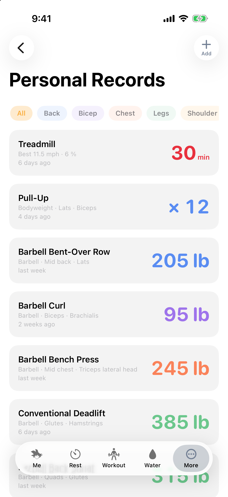
<br clear="right">
<br clear="right">

### 3. Rest — the timer that follows you

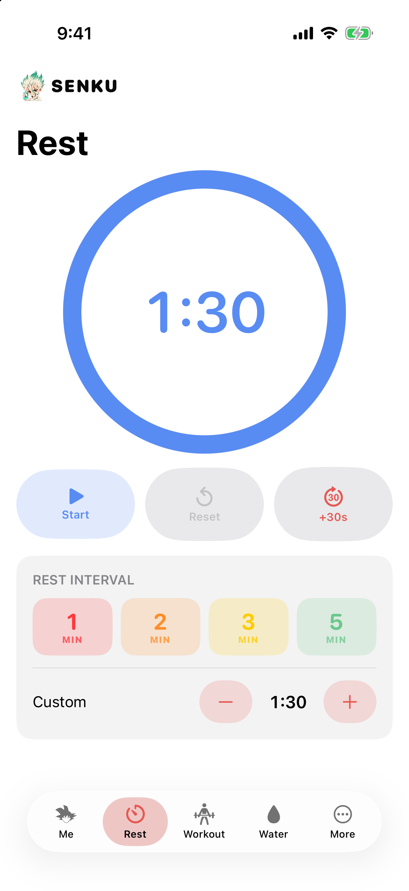

Presets, or set your own. It carries on with the phone locked, shows on the Lock
Screen as a Live Activity, chimes when it is done, and taps your wrist. You can
start it from the Home Screen widget or from Control Center without opening the
app at all.

<br clear="right">

### 4. Drink — *Water*


Three containers you define, one tap each. The bottle fills; the percentage sits
in the middle of it. The goal is never stored — it is resolved from your profile,
whether you trained today, and whether you take creatine, so it moves the day
your weight does instead of going stale.

Reminders run on your interval, inside your waking hours. The widget logs a glass
from the Home Screen, and the total is the same one whichever process you tapped.

<br clear="right">

### 5. Eat — *Food*


Two rings: protein inside, calories outside. Three ways in, because you rarely
know the same things twice —

- **Protein only**, when you know the shake and nothing else.
- **Calories only**, when the label gave you one number.
- **A saved food**, picked by name with a servings stepper.

…and full macro entry when you have the whole label. Days with nothing logged
stay "nothing logged" rather than becoming a zero you failed, and each ring keeps
its own streak.

<br clear="right">

### 6. Watch it move — *Weight*, *Streaks*, *Anime*, *More*

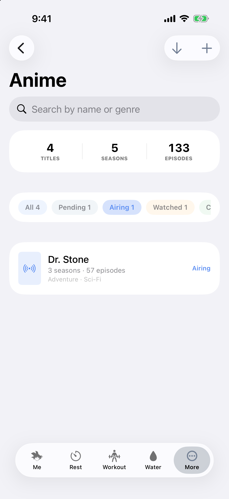

Weigh in, and the weight page fits a trend line and tells you the rate per week
it implies — not the difference between two mornings, which is mostly water.
After a fortnight it offers you the maintenance figure your own data supports.

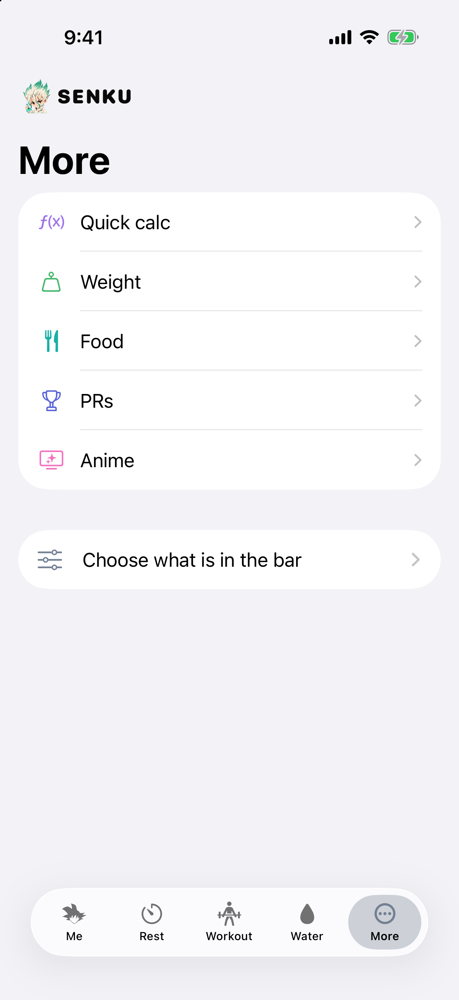

Under *More* sit the plate calculator, the anime list, the streak page, the PDF
export and the navbar settings — and which screens live there rather than in the
bar is entirely your call.

<br clear="right">

---

## On the wrist

<div align="center">
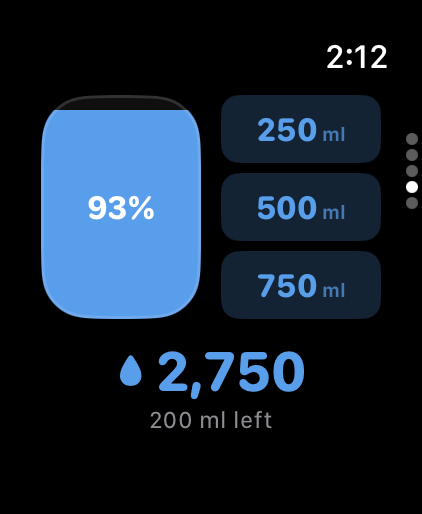 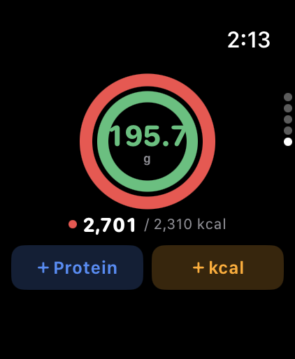 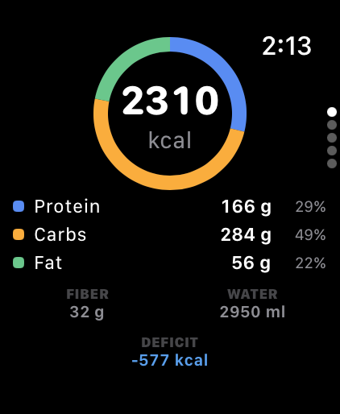 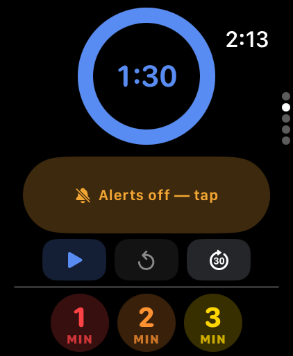
</div>

Water, food, your plan, and the rest timer. Log a drink or a scoop of protein
from the wrist and it is on the phone; the crown moves calories in fives.

**The phone owns the log.** The watch holds a summary plus whatever it has logged
since, and sends each record over as a value with its own id — which is how two
devices avoid holding a list and disagreeing about it.

---

## Install and build

### What you need

- **macOS** with **Xcode 26** or newer
- **iOS 26.5** / **watchOS 26.5** simulators or devices
- Swift 6.0+ — for the packages alone, Xcode is not needed

A free Apple ID is enough. Everything works on a personal team, including the
App Group the widgets and watch read through; iCloud does not, which is why the
backup story is an export you own.

### Get it running

```sh
git clone https://github.com/<you>/senku.git
cd senku
open Senku/Senku.xcodeproj
```

Set **Team** on each target under *Signing & Capabilities* to your Apple ID, pick
an iPhone simulator, and press Run.

### From the command line

```sh
# The logic, on the host — no simulator, ~0.01s
cd SenkuCore && swift test        # 171 tests
cd ../SenkuUI  && swift test      # 73 tests

# The app. Note the *generic* destination — a named device breaks the
# watch link; docs/BUILD.md explains why.
cd ../Senku
xcodebuild -project Senku.xcodeproj -scheme Senku \
  -destination 'generic/platform=iOS Simulator' build
```

### Try it with sample data

Three weeks of realistic workouts, weigh-ins, water, food and anime, loaded
through the same importer a real backup uses:

```sh
SIMCTL_CHILD_SENKU_SAMPLE=1 xcrun simctl launch booted pk.Senku
```

More — the watch pairing, the debug hooks, the entitlement notes — is in
[docs/BUILD.md](docs/BUILD.md).

---

## The technical side

Swift 6 with strict concurrency, SwiftUI, and iOS 26's Liquid Glass. Two Swift
packages hold everything real; the Xcode project is a thin shell that turns them
into four bundles.

```
senku/
├── SenkuCore/                   the arithmetic and the models — no SwiftUI
│   └── Sources/
│       ├── SenkuCore/
│       │   ├── Calculations/    BMR, macros, coverage, streaks, adaptive TDEE
│       │   ├── Models/          the nouns: WeighIn, Exercise, WorkoutSession…
│       │   └── Resources/       ExerciseCatalogue.json — 138 exercises
│       └── SenkuCLI/            `senku plan …` — the maths without an app
├── SenkuUI/                     every screen, and the state behind them
│   └── Sources/SenkuUI/
│       ├── Calculations/        PlateMath — needs the unit types, so it lives here
│       ├── Components/          Card, rings, numeric field, the tab bar
│       ├── Formatting/          units, and how each figure is written
│       ├── LiveActivity/        notifications, reminders, chime, App Intents
│       ├── Reports/             the PDF: layout, charts, section picker
│       ├── Screens/             one file per screen, phone and watch
│       ├── State/               the stores, the importer, the sync
│       └── Theme/               palette and metrics
├── Senku/                       the Xcode project
│   ├── Senku/                   app entry point, sample data
│   ├── SenkuWidgets/            Home Screen widgets, Live Activity, Control
│   ├── SenkuWatch/              watch app entry point
│   ├── SenkuTests/              what can only be checked inside the app bundle
│   └── SenkuUITests/            launches the app and drives it
└── docs/                        the plan, the architecture, the decisions
```

### What it is built out of

| | |
| --- | --- |
| **Swift 6 strict concurrency** | `@Observable` stores, `@MainActor`, `Sendable` values across every process boundary |
| **App Group** (`group.pk.Senku`) | the one place data lives — JSON under versioned keys, shared by app, widgets and watch |
| **WidgetKit + App Intents** | widgets that log a drink or start a rest without opening the app |
| **ActivityKit** | the rest timer on the Lock Screen and in the Dynamic Island |
| **WatchConnectivity** | application context for state, messages and transfers for records |
| **UserNotifications** | reminders, and a deliberate budget inside iOS's 64-request ceiling |
| **Liquid Glass** | `GlassEffectContainer`, `glassEffectID`, interactive tinted capsules |
| **Core Text + Core Graphics** | the PDF — real pagination and vector charts, no screenshots |
| **Swift Testing / XCTest** | 240 host tests, plus bundle and UI tests on a simulator |

### Three decisions worth knowing about

**Every store mutation re-reads first.** The widget writes into the same array
from its own process, and so does the phone during a background launch woken by
the watch. A store holding its launch-time copy would miss those writes *and*
overwrite them on the next one — a drink logged on the Home Screen, or a weigh-in
taken on the wrist, would vanish. Both were real bugs; the rule now lives in
`WaterStore`, `IntakeStore` and `WeightLogStore`.

**Sync starts at app launch, not on a screen.** `PhoneSync.start()` runs from
`SenkuApp.init`, before any scene exists, because the watch can wake the phone in
the background where no view ever appears. It answers from storage rather than
from whatever a screen happens to be holding. Before that, the watch could sit
two days stale.

**The tab bar is a custom control.** The system gives an iPhone five slots and
buries the rest in a list nobody visits. `SenkuTabBar` is one moving glass pill
you drag with your finger; every page stays mounted, so leaving a tab and coming
back is a return rather than a restart. Its doc comment carries the two designs
that were tried and removed.

### Read further

| Document | Contents |
| --- | --- |
| [docs/PROJECT.md](docs/PROJECT.md) | Goals, non-goals, principles, scope |
| [docs/REQUIREMENTS.md](docs/REQUIREMENTS.md) | Functional requirements and acceptance criteria |
| [docs/ARCHITECTURE.md](docs/ARCHITECTURE.md) | Structure, storage, sync, testing |
| [docs/ROADMAP.md](docs/ROADMAP.md) | Milestones and backlog |
| [docs/BUILD.md](docs/BUILD.md) | Build, signing and simulator setup |

---

## Contributing

This started as a personal app for a personal set of habits, and it is open
because other people have habits too. If Senku nearly does what you want, a pull
request is very welcome — a new quick-add, a screen for something I do not track,
a unit I do not use, a fix for a device I do not own.

The short version: open an issue describing the use case first, keep logic in
`SenkuCore` with tests, and explain *why* in the comments rather than *what*. The
full version, including the one rule about numbers on screen, is in
[CONTRIBUTING.md](CONTRIBUTING.md).

---

## Disclaimer

Senku produces estimates from population-level formulas. It is not medical
advice. Talk to a doctor before starting an aggressive deficit.
